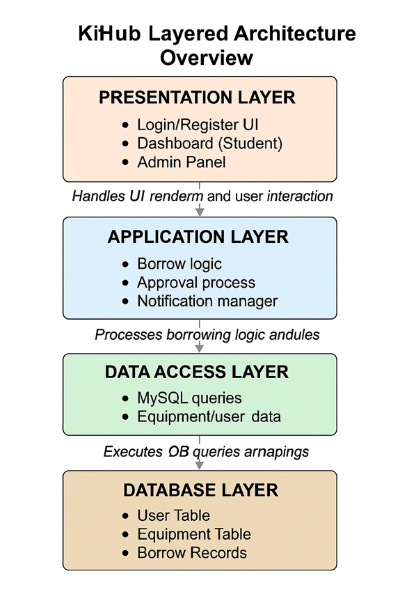

# Design Software Architecture

## KitHub – Campus Used Equipment Library

### a. High-Level Architecture Design

KitHub is designed using a 4-layered architecture model. This structure clearly separates user interface, business logic, data handling, and database storage. It ensures modularity, testability, and simplifies both development and maintenance. Each use case (e.g., borrowing, approvals, login) maps to one or more layers in this architecture.

### b. Architectural Components and Diagram

**The major architectural components follow a layered structure, comprising:**

• Presentation Layer: Handles all UI interactions such as login, dashboards, and admin panel.

• Application Layer: Implements business logic like borrow processing and notifications.

• Data Access Layer: Manages all communication between application logic and the database.

• Database Layer: Stores persistent user, equipment, and transaction data.

---

---

### c. Use Case Realization Through Architecture

This architecture directly supports the system’s key use cases by aligning system responsibilities with each layer:

- The Presentation Layer handles user actions such as logging in and submitting borrow requests.
- The Application Layer validates user input, applies borrowing rules, and coordinates approval logic.
- The Data Access Layer translates application requests into secure and optimized database queries.
- The Database Layer stores and updates the status of all users, items, and borrowing records.

This layered separation allows for independent development, testing, and potential scaling of each part.

### d. Task Matrix

| Task                     | Description                                                          | Responsible Member   |
|:-------------------------|:---------------------------------------------------------------------|:---------------------|
| Architecture Writing     | Described layered architecture and how it supports modular design    | Aylin Barutçu        |
| Diagram Design           | Created and visualized the 4-layer architecture diagram                                                    | Mehmet Karatekin     |
| Alignment with Use Cases | Mapped architecture elements to functional use cases                 | Betül Biçer          |
| Review & Integration     | Ensured consistency with SRS and integration into full document flow | İlbey Efe Taşabatlı  |