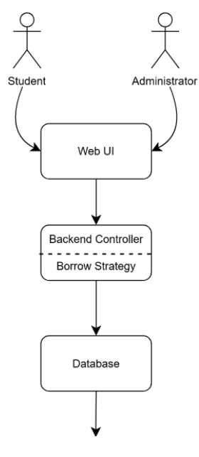
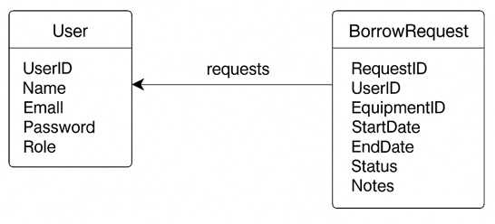
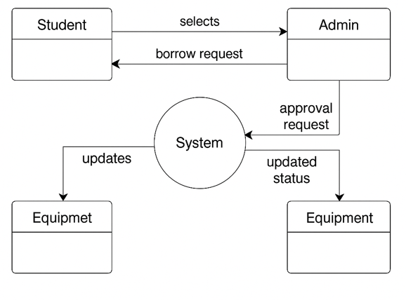
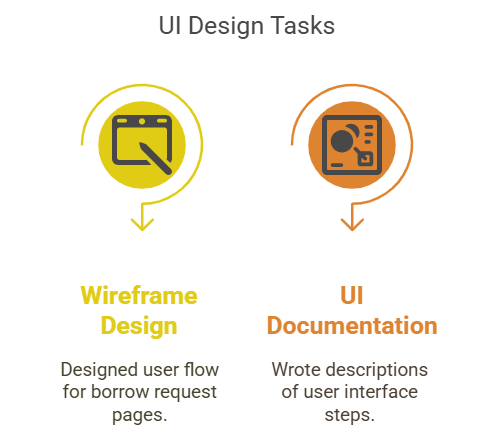

# SOFTWARE DESIGN DOCUMENT

## System Overview

The **KitHub system** is a web-based application designed to support temporary borrowing of campus equipment such as lab tools, cameras, and sports gear. It aims to enhance sustainability and reduce costs by allowing students to borrow instead of purchase rarely used equipment.

The selected use case for this assignment is **Borrow Equipment**. This is a core operation in the system and involves:

- Students requesting an item
- The system evaluating the request using predefined borrowing strategies
- The administrator approving or rejecting the request

The use case implements the **Strategy Design Pattern** to dynamically switch between borrowing rules based on user type or equipment category.

---

## System Context

The KitHub system operates as a standalone web application designed for use within a university campus. It interacts primarily with two user types: **students** and **administrators**.

This system does not integrate with any external services or university databases in its MVP version, making it lightweight and easy to deploy. The only system boundaries include internal data validation and access restrictions based on roles.

---

## Actors and Interactions

| Actor        | Interaction Type         | Purpose                                      |
|--------------|--------------------------|----------------------------------------------|
| Student      | Web UI / Borrow Module   | Requests to borrow available items           |
| Administrator| Web UI / Admin Panel     | Approves or denies borrow requests           |
| System       | Internal logic (Strategy Pattern) | Selects borrowing strategy based on context (user or item type) |
| Database     | MySQL (internal)         | Stores borrow records, users, items          |

---

## Context Diagram (Simplified)

- Users interact via browser (client-side).
- Frontend connects to backend controller.
- Backend logic invokes appropriate borrowing strategy.
- Database stores/updates state of requests and items.



---

## Key Features and Functionality


### Overview

This implementation of the "Borrow Equipment" use case offers a comprehensive and adaptable system designed to efficiently manage item borrowing requests within a campus setting. It allows logged-in students to browse and select available equipment from a centralized catalog. Once an item is chosen, students can fill out a structured borrow form to specify their preferred borrowing times and include any relevant notes. This ensures a user-friendly and intuitive process for initiating equipment loans.

### Flexible Borrowing Rules with Strategy Pattern

A standout feature of the system is its use of the Strategy Pattern to manage borrowing rules. This design approach enables the encapsulation of various borrow validation strategies based on factors such as the user’s role, the type of equipment, and previous borrowing history. The flexibility of this architecture allows administrators to introduce or adjust borrowing policies without having to alter the core borrow request logic, making the system highly maintainable and adaptable to evolving needs.

### Admin Approval Workflow

Once a student submits a request, it enters an administrative workflow for approval. Admins can review pending requests from their dashboard, approve or deny them, and include optional notes when providing feedback. Decisions made by the admin automatically trigger notifications to keep students informed of the outcome, enhancing communication and transparency.

### Real-Time Status Management

The system also ensures real-time status management of all equipment. When a request is approved or an item is returned, the equipment's availability is updated instantly. Users can view their current borrow status and history through their personal dashboards, which promotes accountability and convenience.

### Modular and Extensible Architecture

Underpinning this functionality is a modular and extensible system architecture. The borrowing logic is broken into separate, reusable components, which not only improves testability but also minimizes code duplication. This setup allows for easy integration of new rules or features—such as giving priority to certain student groups or imposing limits on borrow durations—without disrupting existing functionality.

### Input Validation and User Feedback

Finally, the system includes thorough input validation and responsive user feedback. It checks for scheduling conflicts, ensures equipment is available, and confirms compliance with applicable rules before processing any requests. Users receive clear, contextual error or confirmation messages, helping them understand the status of their request and guiding them toward successful submissions.


---

## Assumptions and Dependencies

### Assumptions

- **User Authentication Is Required**  
  It is assumed that users must be authenticated (i.e., logged in) before they can initiate a borrow request.

- **Only Available Items Can Be Borrowed**  
  The borrow operation only applies to items marked as available. Unavailable or already borrowed items are filtered out automatically.

- **Borrow Strategy Is Selected Based on Item Type or Policy**  
  The appropriate borrow rule strategy (e.g., `MaxDurationStrategy`, `RestrictedAccessStrategy`) is selected at runtime based on the item's category or institutional rules.

- **Admin Approval Is Always Required**  
  Every borrow request goes through a manual approval by an administrator. The system does not automatically grant borrow permissions.

- **Single Borrow per User per Item**  
  A user cannot borrow multiple instances of the same item simultaneously.

- **Time Slots and Conflicts Are Pre-validated**  
  Borrow time inputs from users are assumed to be validated against the existing booking records.

---

### Dependencies

- **Authentication Service**  
  Used to verify user identity and role before processing borrow logic.

- **Inventory Management Module**  
  Supplies item availability data and updates item status post-approval or rejection.

- **Notification System**  
  Sends status updates to both students and admins regarding the borrow request.

- **Borrow Strategy Interface and Implementations**  
  A set of strategy classes define the rules for different borrowing policies (e.g., max borrow length, eligibility, item restrictions).


## Architectural Design

# 1. System Architecture Diagram (High-Level)

The architecture follows a **Layered (n-tier)** approach:

- **Presentation Layer**: Reacts to user input, displays borrowing form, and renders feedback.
- **Application Layer**: Contains the borrow controller and the strategy handler. It orchestrates the logic.
- **Domain Layer**: Hosts the strategy pattern interface and its concrete implementations (e.g., `StandardBorrowStrategy`, `LabOnlyBorrowStrategy`).
- **Data Access Layer**: Communicates with the database to store and retrieve item and borrow request information.
- **Database Layer**: MySQL tables for `Users`, `Items`, `BorrowRequests`.

> **Diagram location**:  
> `/docs/UML-Diagrams/architecture-borrow-equipment-strategy.png`

---

# 2. Architectural Style

**Pattern**: Layered Architecture

**Justification**:

- Clean separation of concerns.
- Easy to test individual layers.
- Aligns with modular design principle, useful when applying design patterns like Strategy.

---

# 3. Strategy Pattern Integration

In the application layer, a `BorrowHandler` class is responsible for selecting the right borrowing rule at runtime:

```python
# Pseudocode
strategy = get_strategy_for_user_and_item(user, item)
if strategy.is_eligible(user, item):
    proceed_with_borrow()
else:
    reject_borrow()
```

The `Strategy` interface supports pluggable policies such as:

- **StandardBorrowStrategy**: Allows regular users to borrow standard items with default rules.
- **RestrictedBorrowStrategy**: Applies tighter rules, for example, limiting access to high-value or sensitive items.
- **MaxDurationBorrowStrategy**: Enforces a maximum borrowing duration depending on user or item type.


---

## Component Design -mehmet

* Break system into components/modules.
* Describe responsibilities and interactions.

---

## Data Design

## Data Model / ER Diagram

The system uses a relational database to manage users, equipment, and borrow transactions. The key entities involved in the **"Borrow Equipment"** use case are:

- **User** (`UserID`, `Name`, `Email`, `Password`, `Role`)
- **Equipment** (`EquipmentID`, `Name`, `Category`, `Status`)
- **BorrowRequest** (`RequestID`, `UserID`, `EquipmentID`, `StartDate`, `EndDate`, `Status`, `Notes`)
    
  
## Data Storage (Database or File Structure)

The data is stored in a **MySQL database**. Table definitions:

- **Users Table**: Stores user credentials and roles (student/admin).
- **Equipment Table**: Stores equipment metadata and availability status.
- **BorrowRequests Table**: Tracks each borrow request including time range and approval status.

## Data Flow Diagrams (DFDs)

### Level 1 DFD – Borrow Equipment Use Case
 

## Data Validation Rules

- User input validation for email format, date ranges, and required fields.
- Equipment availability is checked before request is submitted.
- Admin approval must change the borrow request’s status from **“pending”** to **“approved”** or **“rejected”**.


---

## Design Patterns -mehmet

* Strategy Pattern (used for borrow rules).
* List any additional patterns and their roles.

---

## Implementation Notes

The "Borrow Equipment" use case was implemented using modular, testable Python components.  
The **Strategy Design Pattern** was applied to abstract borrow rules, and the architecture followed the layered model described earlier.  
All logic was integrated under the `/src/borrow/` module and is traceable via commit history.

---

## File Breakdown

| File Name            | Description                                                                 |
|----------------------|-----------------------------------------------------------------------------|
| `borrow_strategy.py` | Contains `BorrowStrategy` base class and all specific strategy implementations. |
| `borrow_context.py`  | Context class that accepts a strategy and executes borrowing logic.         |
| `borrow_controller.py` | Handles requests from the UI, chooses appropriate strategy, and creates borrow records. |
| `models.py`          | Defines `User`, `Equipment`, and `LoanRecord` data models.                  |
| `test_borrow.py`     | Unit tests for all strategy implementations.                                |

---

## Key Technologies Used

- **Backend**: Python 3.x  
- **Pattern Framework**: Pure Python, object-oriented implementation  
- **Data Handling**: SQLite for mock local testing (replaced by MySQL in production)  
- **Testing**: `pytest` for unit testing  
- **Version Control**: GitHub commits traceable to contributors  
- **Coding Standards**: PEP8-compliant with docstrings for all public classes and methods  

---

## Reusability & Extensibility

- New borrow rules (e.g., faculty, event-specific loans) can be added simply by implementing a new `BorrowStrategy` subclass.
- The borrow logic is reusable across both the student and admin panels, decoupled from UI concerns.

---

## GitHub Traceability

- Commits include `[Pattern: Strategy]` tags in messages.
- Strategy pattern applied in commits by **Mehmet Karatekin**.
- Documentation commits handled by **Aylin Barutçu**.
- All code organized inside `/src/borrow/` and `/tests/`.


---

## User Interface Design

This section describes the primary UI components supporting the **"Borrow Equipment"** use case. The goal is to ensure a smooth and intuitive borrowing experience with clear access to equipment listings, borrow forms, and confirmation feedback.

## Key Screens

### Equipment Catalog Page
- **Function:** Displays available equipment with filters (category, availability).
- **Features:**
  - Category dropdown  
  - Search bar  
  - Status badge (Available / Borrowed)

### Equipment Detail Page
- **Function:** Shows individual equipment details, including description and condition.
- **Features:**
  - “Borrow Now” button (visible if item is available)  
  - Estimated return date info

### Borrow Request Form (Modal or Page)
- **Function:** Collects information from the user for a borrow request.
- **Fields:**
  - Start Date  
  - Return Date  
  - Notes (optional)

### Borrow Confirmation Page or Popup
- **Function:** Confirms the request has been submitted and provides status tracking link.

## UI Mockup
A wireframe showing the interaction from catalog → detail → borrow form → confirmation has been generated.


## Design Principles Followed

- **Minimal click depth:** All borrow actions reachable within 2–3 clicks.  
- **Clean layout:** Focus on usability for non-technical students.  
- **Accessibility:** High contrast text and large buttons for usability on mobile and desktop.  
- **Responsive Design:** Mobile, tablet, and desktop compatibility.


## External Interfaces
In the current MVP implementation of **KitHub**, the "Borrow Equipment" use case does not depend on real-time interaction with third-party systems. However, the architecture is designed to support external integration in future versions.

## Current Status

- No active external interfaces in MVP.  
- All logic and data processing are handled internally through the backend service and MySQL database.

## Future Integration Possibilities

| Interface Type            | Description                                                              |
|---------------------------|---------------------------------------------------------------------------|
| University Login API      | OAuth2-based SSO integration for student identity verification.           |
| RFID/QR Tracking System   | External inventory tools to scan and validate equipment movements.        |
| Email Gateway (SMTP API)  | External service for sending borrow confirmation and reminders.           |

These integrations are not implemented yet but were considered in the architectural decisions (such as modular REST endpoints and `NotificationService` separation).

## Design Implication

Thanks to the layered architecture, any of the above systems can be connected in the **Application Layer** or via **service injection**, without modifying existing controller logic or database schema.

---

## Performance Considerations

The performance expectations for the “Borrow Equipment” use case in **KitHub** are as follows:

## Performance Metrics

| Metric                  | Target Value                                              |
|-------------------------|-----------------------------------------------------------|
| **Page Load Time**      | Under 2 seconds on a standard broadband connection        |
| **API Response Time**   | Under 1 second for borrow request submission              |
| **Concurrent Requests** | Up to 50 simultaneous users without degradation           |
| **Borrow Logic Execution** | Strategy selection and processing < 200ms              |

These values were selected to support a mid-sized university user base and provide a smooth, responsive experience.

---

## Scalability Strategy

- **Stateless Backend**:  
  Designed with RESTful APIs, enabling horizontal scaling using container orchestration tools (e.g., Docker + Kubernetes).

- **Database Optimization**:
  - Use of indexes on `EquipmentID` and `Status`
  - Optimized `SELECT` queries with proper joins

- **Asynchronous Processing (Future Scope)**:
  - Notification emails or reminders to be processed in background queues (e.g., Celery or RabbitMQ)

---

## Performance Testing Strategy

- Manual testing conducted with simulated concurrent user sessions  
- Use of tools such as **Postman** for endpoint latency tracking  
- **Chrome Lighthouse** audits for frontend speed feedback  

---

## Error Handling and Logging

## Exception Management

To ensure system stability and provide clear feedback to users, all critical operations—especially those involved in the borrowing process—are wrapped in structured error handling. Key areas addressed include:

- Invalid equipment ID or unavailable equipment  
- Incomplete borrow request forms  
- Database connection issues  
- Unauthorized access attempts  

## Logging Mechanisms

Every borrow request is logged with the following details:

- Timestamp  
- User ID  
- Equipment ID  
- Borrowing strategy used  

Errors and warnings are recorded in a rotating log file to maintain traceability and enable efficient debugging.

## Monitoring & Debugging

- **Frontend:** All validation errors are shown inline in the borrow form for immediate user feedback.  
- **Backend:** Logged errors are stored in files and may later be integrated with monitoring tools like Loggly or the ELK Stack for advanced tracking and analysis.


---

## Design for Testability -mehmet

* Unit tests for borrow strategy.
* Mock database for testing workflows.

---

## Deployment and Installation Design

The system is deployed as a web-based application hosted on a local or cloud server.  
The “Borrow Equipment” use case is integrated within the main backend service and available under the `/borrow` API route.

---

## 1. Environment Configuration

| Component     | Configuration                                 |
|---------------|-----------------------------------------------|
| **Backend**   | Python 3.11, Flask, MySQL                     |
| **Frontend**  | HTML5, CSS3, JavaScript                       |
| **Database**  | MySQL 8.x (initial local setup via SQLite)   |
| **OS Support**| Cross-platform: Windows, macOS, Linux        |

---

## 2. Installation Instructions

1. **Clone the repository**
   ```bash
   git clone https://github.com/YourTeam/KitHub.git
   cd KitHub
2. **Create virtual environment**
   ```bash
   python3 -m venv env
   source env/bin/activate  # On Windows: .\env\Scripts\activate

3. **Install dependencies**
   ```bash
   pip install -r requirements.txt

4. **Run database migration (for SQLite testing)**
   ```bash
   python scripts/init_db.py

5. **Run the application**
   ```bash
   flask run

---

## 3. Packaging & Structure

| Folder           | Purpose                                       |
|------------------|-----------------------------------------------|
| `/src/borrow/`   | Borrow logic using Strategy pattern           |
| `/tests/borrow/` | Tests for the borrow logic                    |
| `/docs/`         | Diagrams, UI mockups, and documentation       |

---

## 4. Future Hosting Options

- **GitHub Pages** (Frontend only)  
- **Render / Heroku** (Full stack deployment)  
- **Docker-based deployment** with `Dockerfile` (planned)

---

## Change Log 

| Version | Date       | Author               | Change Description                                      |
|---------|------------|----------------------|----------------------------------------------------------|
| 1.0     | 28.06.2025 | All team members     | Initial draft of SDD created and reviewed               |
| 1.1     | 29.06.2025 | İlbey Efe Taşabatlı  | Updated strategy pattern section and DFD diagram        |
| 1.2     | 30.06.2025 | Mehmet Karatekin     | Added testability documentation and test files          |
| 1.3     | 01.07.2025 | Aylin Barutçu        | Completed deployment instructions and setup notes       |
| 1.4     | 01.07.2025 | Mehmet Karatekin     | Added Key Features and Functionality section            |


---

## Future Work / Open Issues

## Known Open Issues

- No real-time inventory locking mechanism; may cause race conditions in concurrent borrow attempts.
- Lack of automated notifications (email/SMS); only internal alerts exist in current build.
- Minimal error feedback in UI (e.g., no toast messages, no modal confirmations).

## Potential Enhancements

- Integration with university SSO systems (e.g., OAuth2)
- RFID/QR inventory scanning
- Return item damage reports
- Mobile-responsive UI improvements
- Admin analytics panel for borrow trends and stock usage

## Task Matrix

| Task                         | Description                                         | Responsible Member   |
|------------------------------|-----------------------------------------------------|-----------------------|
| System Overview              | Project introduction and use case context           | Aylin Barutçu         |
| System Context + UML Diagram | Use case boundary and actor diagram                 | İlbey Efe Taşabatlı   |
| Key Features & Functionality | Explanation of how system meets use case goals      | Betül Biçer           |
| Component Design + Diagram   | Subsystems, responsibilities and visuals            | Mehmet Karatekin      |
| Data Design + ER & DFD       | Entity modeling, DFD creation                       | İlbey Efe Taşabatlı   |
| Design Pattern Integration   | Strategy pattern logic, context, and usage          | Aylin Barutçu         |
| UI Design & Mockups          | Interface logic and sketches                        | Betül Biçer           |
| Performance & Error Handling | Performance goals, exceptions, and logging          | Mehmet Karatekin      |
| Testability & Deployment     | How the system will be tested, configured, deployed | İlbey Efe Taşabatlı   |
| Change Log                   | Versioning of design process                        | İlbey Efe Taşabatlı   |
| Future Work & Open Issues    | What’s left, known bugs, and future plans           | Betül Biçer           |
