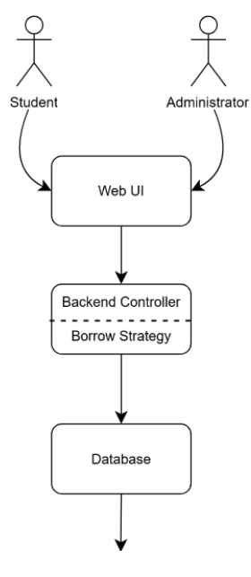
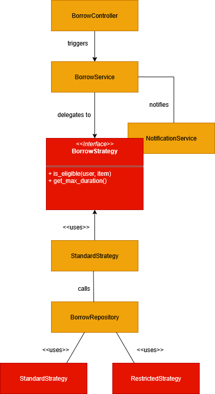
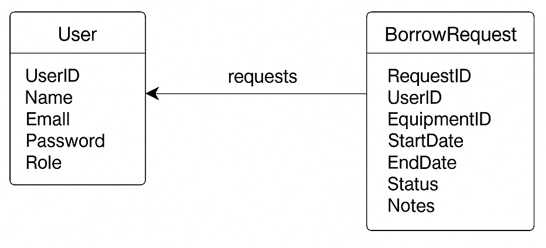
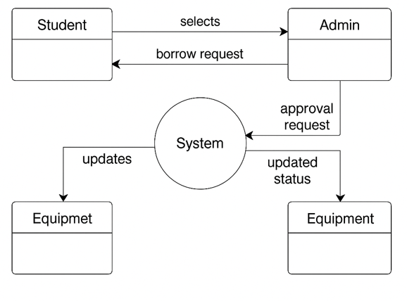
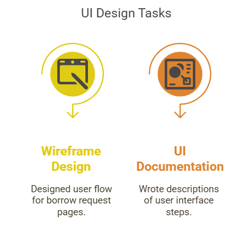

# SOFTWARE DESIGN DOCUMENT

## System Overview

The **KitHub system** is a web-based application designed to support temporary borrowing of campus equipment such as lab tools, cameras, and sports gear. It aims to enhance sustainability and reduce costs by allowing students to borrow instead of purchase rarely used equipment.

The selected use case for this assignment is **Borrow Equipment**. This is a core operation in the system and involves:

- Students requesting an item
- The system evaluating the request using predefined borrowing strategies
- The administrator approving or rejecting the request

The use case implements the **Strategy Design Pattern** to dynamically switch between borrowing rules based on user type or equipment category.

---

## System Context

The KitHub system operates as a standalone web application designed for use within a university campus. It interacts primarily with two user types: **students** and **administrators**.

This system does not integrate with any external services or university databases in its MVP version, making it lightweight and easy to deploy. The only system boundaries include internal data validation and access restrictions based on roles.

---

## Actors and Interactions

| Actor        | Interaction Type         | Purpose                                      |
|--------------|--------------------------|----------------------------------------------|
| Student      | Web UI / Borrow Module   | Requests to borrow available items           |
| Administrator| Web UI / Admin Panel     | Approves or denies borrow requests           |
| System       | Internal logic (Strategy Pattern) | Selects borrowing strategy based on context (user or item type) |
| Database     | MySQL (internal)         | Stores borrow records, users, items          |

---

## Context Diagram (Simplified)

- Users interact via browser (client-side).
- Frontend connects to backend controller.
- Backend logic invokes appropriate borrowing strategy.
- Database stores/updates state of requests and items.



---

## Key Features and Functionality


### Overview

This implementation of the "Borrow Equipment" use case offers a comprehensive and adaptable system designed to efficiently manage item borrowing requests within a campus setting. It allows logged-in students to browse and select available equipment from a centralized catalog. Once an item is chosen, students can fill out a structured borrow form to specify their preferred borrowing times and include any relevant notes. This ensures a user-friendly and intuitive process for initiating equipment loans.

### Flexible Borrowing Rules with Strategy Pattern

A standout feature of the system is its use of the Strategy Pattern to manage borrowing rules. This design approach enables the encapsulation of various borrow validation strategies based on factors such as the user’s role, the type of equipment, and previous borrowing history. The flexibility of this architecture allows administrators to introduce or adjust borrowing policies without having to alter the core borrow request logic, making the system highly maintainable and adaptable to evolving needs.

### Admin Approval Workflow

Once a student submits a request, it enters an administrative workflow for approval. Admins can review pending requests from their dashboard, approve or deny them, and include optional notes when providing feedback. Decisions made by the admin automatically trigger notifications to keep students informed of the outcome, enhancing communication and transparency.

### Real-Time Status Management

The system also ensures real-time status management of all equipment. When a request is approved or an item is returned, the equipment's availability is updated instantly. Users can view their current borrow status and history through their personal dashboards, which promotes accountability and convenience.

### Modular and Extensible Architecture

Underpinning this functionality is a modular and extensible system architecture. The borrowing logic is broken into separate, reusable components, which not only improves testability but also minimizes code duplication. This setup allows for easy integration of new rules or features—such as giving priority to certain student groups or imposing limits on borrow durations—without disrupting existing functionality.

### Input Validation and User Feedback

Finally, the system includes thorough input validation and responsive user feedback. It checks for scheduling conflicts, ensures equipment is available, and confirms compliance with applicable rules before processing any requests. Users receive clear, contextual error or confirmation messages, helping them understand the status of their request and guiding them toward successful submissions.


---

## Assumptions and Dependencies

### Assumptions

- **User Authentication Is Required**  
  It is assumed that users must be authenticated (i.e., logged in) before they can initiate a borrow request.

- **Only Available Items Can Be Borrowed**  
  The borrow operation only applies to items marked as available. Unavailable or already borrowed items are filtered out automatically.

- **Borrow Strategy Is Selected Based on Item Type or Policy**  
  The appropriate borrow rule strategy (e.g., `MaxDurationStrategy`, `RestrictedAccessStrategy`) is selected at runtime based on the item's category or institutional rules.

- **Admin Approval Is Always Required**  
  Every borrow request goes through a manual approval by an administrator. The system does not automatically grant borrow permissions.

- **Single Borrow per User per Item**  
  A user cannot borrow multiple instances of the same item simultaneously.

- **Time Slots and Conflicts Are Pre-validated**  
  Borrow time inputs from users are assumed to be validated against the existing booking records.

---

### Dependencies

- **Authentication Service**  
  Used to verify user identity and role before processing borrow logic.

- **Inventory Management Module**  
  Supplies item availability data and updates item status post-approval or rejection.

- **Notification System**  
  Sends status updates to both students and admins regarding the borrow request.

- **Borrow Strategy Interface and Implementations**  
  A set of strategy classes define the rules for different borrowing policies (e.g., max borrow length, eligibility, item restrictions).


## Architectural Design

# 1. System Architecture Diagram (High-Level)

The architecture follows a **Layered (n-tier)** approach:

- **Presentation Layer**: Reacts to user input, displays borrowing form, and renders feedback.
- **Application Layer**: Contains the borrow controller and the strategy handler. It orchestrates the logic.
- **Domain Layer**: Hosts the strategy pattern interface and its concrete implementations (e.g., `StandardBorrowStrategy`, `LabOnlyBorrowStrategy`).
- **Data Access Layer**: Communicates with the database to store and retrieve item and borrow request information.
- **Database Layer**: MySQL tables for `Users`, `Items`, `BorrowRequests`.

---

# 2. Architectural Style

**Pattern**: Layered Architecture

**Justification**:

- Clean separation of concerns.
- Easy to test individual layers.
- Aligns with modular design principle, useful when applying design patterns like Strategy.

---

# 3. Strategy Pattern Integration

In the application layer, a `BorrowHandler` class is responsible for selecting the right borrowing rule at runtime:

```python
# Pseudocode
strategy = get_strategy_for_user_and_item(user, item)
if strategy.is_eligible(user, item):
    proceed_with_borrow()
else:
    reject_borrow()
```

The `Strategy` interface supports pluggable policies such as:

- **StandardBorrowStrategy**: Allows regular users to borrow standard items with default rules.
- **RestrictedBorrowStrategy**: Applies tighter rules, for example, limiting access to high-value or sensitive items.
- **MaxDurationBorrowStrategy**: Enforces a maximum borrowing duration depending on user or item type.


---

## Component Design

### Subsystems and Modules

The "Borrow Equipment" system is structured into well-defined subsystems and modules, each responsible for a specific aspect of the borrowing process. At the core of the architecture is the `BorrowController`, which acts as the entry point for handling borrow requests originating from the frontend. It delegates the processing logic to the `BorrowService`, which contains the primary business logic and coordinates interactions with other components.

To enforce borrowing rules, the system utilizes a flexible strategy design pattern. This is implemented via the `BorrowStrategy` interface, which defines the core contract for all strategy classes. Concrete implementations such as `StandardBorrowStrategy` and `RestrictedBorrowStrategy` apply specific eligibility rules depending on user roles, item categories, or historical borrowing data. The persistence of borrow requests is managed by the `BorrowRepository`, which communicates with a MySQL database. Meanwhile, the `NotificationService` is responsible for alerting users and administrators about the status of their requests through emails or dashboard notifications.

### Component Responsibilities

The `BorrowController` exposes a borrow request endpoint (e.g., `/api/borrow`) and acts as a conduit between the frontend and backend systems. Upon receiving a request, it packages the user and item data and forwards it to the `BorrowService`.

The `BorrowService` orchestrates the business logic by selecting the appropriate borrowing strategy through a `StrategySelector`, validating the request, and deciding whether to persist it or return an error. It serves as the central hub connecting validation, data management, and user communication.

All borrowing rules are encapsulated within implementations of the `BorrowStrategy` interface. Each strategy must define two core methods: `is_eligible(user, item)` to assess whether the borrow request meets defined criteria, and `get_max_duration()` to enforce duration limits.

Data operations are handled by the `BorrowRepository`, which executes the SQL queries necessary to save requests and retrieve their status. On the communication front, the `NotificationService` generates and delivers context-aware messages, informing users and admins of approval or rejection outcomes.

### Interfaces Between Components

The interaction flow between components is both logical and decoupled. The `BorrowController` communicates directly with the `BorrowService`, which in turn interacts with multiple subsystems: the selected `BorrowStrategy` for rule validation, the `BorrowRepository` for database operations, and the `NotificationService` for user updates.

This modular setup ensures high cohesion within each component and low coupling between components. As a result, the system remains maintainable, extensible, and testable—ideal for scaling or integrating new features in the future.



---

## Data Design

## Data Model / ER Diagram

The system uses a relational database to manage users, equipment, and borrow transactions. The key entities involved in the **"Borrow Equipment"** use case are:

- **User** (`UserID`, `Name`, `Email`, `Password`, `Role`)
- **Equipment** (`EquipmentID`, `Name`, `Category`, `Status`)
- **BorrowRequest** (`RequestID`, `UserID`, `EquipmentID`, `StartDate`, `EndDate`, `Status`, `Notes`)
    
  
## Data Storage (Database or File Structure)

The data is stored in a **MySQL database**. Table definitions:

- **Users Table**: Stores user credentials and roles (student/admin).
- **Equipment Table**: Stores equipment metadata and availability status.
- **BorrowRequests Table**: Tracks each borrow request including time range and approval status.

## Data Flow Diagrams (DFDs)

### Level 1 DFD – Borrow Equipment Use Case
 

## Data Validation Rules

- User input validation for email format, date ranges, and required fields.
- Equipment availability is checked before request is submitted.
- Admin approval must change the borrow request’s status from **“pending”** to **“approved”** or **“rejected”**.


---

## Design Patterns

### Context

In KitHub, the borrowing process for campus equipment involves varying rules depending on several dynamic factors. For instance, the type of equipment—whether lab tools, cameras, or sports gear—can dictate different borrowing conditions. Additionally, borrower roles, such as regular students versus club members, also influence eligibility and loan privileges. The loan duration itself may be capped differently based on these variables. Due to these contextual nuances, the Strategy Pattern is a natural fit. It allows each borrowing rule to be encapsulated in its own class, making the system adaptable and easy to extend as new borrowing policies emerge.

### Why Strategy Pattern?

The application of the Strategy Pattern here aligns closely with solid design principles, particularly the Open/Closed Principle. This means the borrow logic is open for extension but closed for modification. Developers can introduce new borrow policies by simply creating new strategy classes, without touching the core logic already in place. This structure also significantly improves testability. Since each borrow strategy is an isolated unit, mock strategies can be easily injected during unit testing, resulting in clearer and more maintainable test cases. More broadly, the use of this pattern supports a clean separation of concerns, as each strategy class focuses solely on its specific borrowing rules without being entangled in other responsibilities.

### How It’s Applied

The foundation of this approach is a shared interface: `BorrowStrategy`. This defines a single method, `execute_borrow(user, equipment)`, which every strategy implementation must override. For example, `StandardBorrowStrategy` provides the default behavior by assigning a 7-day loan period. In contrast, `ClubBorrowStrategy` extends this privilege, allowing club members to borrow items for up to 14 days. These classes remain focused and concise, each returning a `LoanRecord` object that captures the terms of the borrow transaction.

To execute borrowing behavior, a `BorrowContext` class is used. This context is initialized with a specific strategy and exposes a `borrow()` method. Internally, it simply delegates the borrow logic to the provided strategy. This structure keeps the context flexible and reusable for any future strategies that might be introduced.

### Project Structure and Usage

The implementation is cleanly organized under the `/src/borrow/` directory. Strategy classes reside in `borrow_strategy.py`, the context logic is housed in `borrow_context.py`, and all related unit tests are defined in `test_borrow.py`. This structure keeps the borrowing feature modular and easy to maintain.

In practice, the system selects the appropriate strategy based on the user’s role. For example, if the user is a club member, the `ClubBorrowStrategy` is applied; otherwise, the system defaults to `StandardBorrowStrategy`. Once the strategy is chosen, the `BorrowContext` takes over and executes the logic, returning the configured loan details.

### Measurable Improvement

This refactoring has produced immediate benefits. What was once around 80 lines of intertwined borrow logic has now been distilled into small, focused classes—each under 30 lines of code. In parallel, four new unit test cases have been added, each targeting specific strategies and ensuring correctness in diverse scenarios. Most notably, adding a new borrowing rule no longer requires touching the existing system. Developers simply introduce a new class, implement the strategy interface, and integrate it—no changes to the core borrowing logic are necessary. This marks a meaningful step forward in both maintainability and scalability.

---

## Implementation Notes

The "Borrow Equipment" use case was implemented using modular, testable Python components.  
The **Strategy Design Pattern** was applied to abstract borrow rules, and the architecture followed the layered model described earlier.  
All logic was integrated under the `/src/borrow/` module and is traceable via commit history.

---

## File Breakdown

| File Name            | Description                                                                 |
|----------------------|-----------------------------------------------------------------------------|
| `borrow_strategy.py` | Contains `BorrowStrategy` base class and all specific strategy implementations. |
| `borrow_context.py`  | Context class that accepts a strategy and executes borrowing logic.         |
| `borrow_controller.py` | Handles requests from the UI, chooses appropriate strategy, and creates borrow records. |
| `models.py`          | Defines `User`, `Equipment`, and `LoanRecord` data models.                  |
| `test_borrow.py`     | Unit tests for all strategy implementations.                                |

---

## Key Technologies Used

- **Backend**: Python 3.x  
- **Pattern Framework**: Pure Python, object-oriented implementation  
- **Data Handling**: SQLite for mock local testing (replaced by MySQL in production)  
- **Testing**: `pytest` for unit testing  
- **Version Control**: GitHub commits traceable to contributors  
- **Coding Standards**: PEP8-compliant with docstrings for all public classes and methods  

---

## Reusability & Extensibility

- New borrow rules (e.g., faculty, event-specific loans) can be added simply by implementing a new `BorrowStrategy` subclass.
- The borrow logic is reusable across both the student and admin panels, decoupled from UI concerns.

---

## GitHub Traceability

- Commits include `[Pattern: Strategy]` tags in messages.
- Strategy pattern applied in commits by **Mehmet Karatekin**.
- Documentation commits handled by **Aylin Barutçu**.
- All code organized inside `/src/borrow/` and `/tests/`.


---

## User Interface Design

This section describes the primary UI components supporting the **"Borrow Equipment"** use case. The goal is to ensure a smooth and intuitive borrowing experience with clear access to equipment listings, borrow forms, and confirmation feedback.

## Key Screens

### Equipment Catalog Page
- **Function:** Displays available equipment with filters (category, availability).
- **Features:**
  - Category dropdown  
  - Search bar  
  - Status badge (Available / Borrowed)

### Equipment Detail Page
- **Function:** Shows individual equipment details, including description and condition.
- **Features:**
  - “Borrow Now” button (visible if item is available)  
  - Estimated return date info

### Borrow Request Form (Modal or Page)
- **Function:** Collects information from the user for a borrow request.
- **Fields:**
  - Start Date  
  - Return Date  
  - Notes (optional)

### Borrow Confirmation Page or Popup
- **Function:** Confirms the request has been submitted and provides status tracking link.

## UI Mockup
A wireframe showing the interaction from catalog → detail → borrow form → confirmation has been generated.


## Design Principles Followed

- **Minimal click depth:** All borrow actions reachable within 2–3 clicks.  
- **Clean layout:** Focus on usability for non-technical students.  
- **Accessibility:** High contrast text and large buttons for usability on mobile and desktop.  
- **Responsive Design:** Mobile, tablet, and desktop compatibility.


## External Interfaces
In the current MVP implementation of **KitHub**, the "Borrow Equipment" use case does not depend on real-time interaction with third-party systems. However, the architecture is designed to support external integration in future versions.

## Current Status

- No active external interfaces in MVP.  
- All logic and data processing are handled internally through the backend service and MySQL database.

## Future Integration Possibilities

| Interface Type            | Description                                                              |
|---------------------------|---------------------------------------------------------------------------|
| University Login API      | OAuth2-based SSO integration for student identity verification.           |
| RFID/QR Tracking System   | External inventory tools to scan and validate equipment movements.        |
| Email Gateway (SMTP API)  | External service for sending borrow confirmation and reminders.           |

These integrations are not implemented yet but were considered in the architectural decisions (such as modular REST endpoints and `NotificationService` separation).

## Design Implication

Thanks to the layered architecture, any of the above systems can be connected in the **Application Layer** or via **service injection**, without modifying existing controller logic or database schema.

---

## Performance Considerations

The performance expectations for the “Borrow Equipment” use case in **KitHub** are as follows:

## Performance Metrics

| Metric                  | Target Value                                              |
|-------------------------|-----------------------------------------------------------|
| **Page Load Time**      | Under 2 seconds on a standard broadband connection        |
| **API Response Time**   | Under 1 second for borrow request submission              |
| **Concurrent Requests** | Up to 50 simultaneous users without degradation           |
| **Borrow Logic Execution** | Strategy selection and processing < 200ms              |

These values were selected to support a mid-sized university user base and provide a smooth, responsive experience.

---

## Scalability Strategy

- **Stateless Backend**:  
  Designed with RESTful APIs, enabling horizontal scaling using container orchestration tools (e.g., Docker + Kubernetes).

- **Database Optimization**:
  - Use of indexes on `EquipmentID` and `Status`
  - Optimized `SELECT` queries with proper joins

- **Asynchronous Processing (Future Scope)**:
  - Notification emails or reminders to be processed in background queues (e.g., Celery or RabbitMQ)

---

## Performance Testing Strategy

- Manual testing conducted with simulated concurrent user sessions  
- Use of tools such as **Postman** for endpoint latency tracking  
- **Chrome Lighthouse** audits for frontend speed feedback  

---

## Error Handling and Logging

## Exception Management

To ensure system stability and provide clear feedback to users, all critical operations—especially those involved in the borrowing process—are wrapped in structured error handling. Key areas addressed include:

- Invalid equipment ID or unavailable equipment  
- Incomplete borrow request forms  
- Database connection issues  
- Unauthorized access attempts  

## Logging Mechanisms

Every borrow request is logged with the following details:

- Timestamp  
- User ID  
- Equipment ID  
- Borrowing strategy used  

Errors and warnings are recorded in a rotating log file to maintain traceability and enable efficient debugging.

## Monitoring & Debugging

- **Frontend:** All validation errors are shown inline in the borrow form for immediate user feedback.  
- **Backend:** Logged errors are stored in files and may later be integrated with monitoring tools like Loggly or the ELK Stack for advanced tracking and analysis.


---

## Design for Testability

### Testability Goals

A key objective in designing the borrow equipment system has been to ensure that it is highly testable at every level of the architecture. The adoption of the Strategy Pattern plays a significant role here, as it enables modular testing of different borrow logic scenarios without altering the core flow. Each strategy implementation can be tested in isolation, allowing for more focused and meaningful unit tests. To support maintainability and reliability, the system is designed to minimize external dependencies—particularly through the use of mocking for both the database layer and the borrow strategies. This isolation enables tests to run quickly and consistently. The overarching goal is to achieve over 80% code coverage across all core components related to borrowing, which ensures a strong foundation for long-term quality and change safety.

### Testing Strategy by Layer

The testing strategy is organized by logical layers in the system. For `BorrowStrategy` subclasses, unit tests are written to confirm that each strategy enforces the correct rules for eligibility and loan duration. The `BorrowContext` class, which orchestrates strategy execution, is tested using behavioral tests with mocked strategies. This ensures that delegation is functioning correctly and that exceptions or edge cases are handled as expected.

At the integration level, the `/borrow` API endpoint is tested using a backend test client to simulate full borrow workflows—from input to response—while ensuring backend logic and validations are integrated properly. On the frontend, form validation logic is manually verified using browser developer tools (e.g., Chrome DevTools), with a focus on real-time input validation and user feedback behavior.

### Tools and Frameworks

Testing is built on familiar and robust tooling. The backend makes use of `pytest` as the core testing framework, with `unittest.mock` providing support for mocking out database calls, external services, and strategy logic. For test data management and isolation, an in-memory SQLite database is used, allowing tests to run in a clean and disposable environment. This setup ensures database operations can be validated without relying on production-like data or persistent state. On the frontend, manual testing is performed using browser tools to inspect form-level validations and event-driven user feedback.

### Sample Test Case

Here's a concrete example that illustrates how business rules are enforced through testing. In the following test, a piece of equipment marked as already borrowed should raise an error when a user attempts to request it:
```python
def test_borrow_equipment_unavailable():
    strategy = SimpleBorrowStrategy()
    context = BorrowContext(strategy)
    user = MockUser(role="student")
    equipment = MockEquipment(status="borrowed")
    with pytest.raises(EquipmentUnavailableError):
        context.borrow(user, equipment)
```
This unit test ensures that the strategy and context work together correctly and that invalid borrowing attempts are blocked as expected.

### Coverage and Maintainability

The codebase emphasizes clarity and maintainability. Each module in the borrow system is kept under 100 lines and adheres to the single-responsibility principle, making it easier to test, debug, and evolve independently. All related tests are organized in `/borrow/test_borrow.py`, grouped by the class or function under test. Every borrow strategy has dedicated test coverage to verify not only expected use cases but also edge cases such as invalid roles, unavailable items, and loan duration limits. As a result, the borrow logic remains robust, flexible, and easy to extend or refactor as new rules emerge.

---

## Deployment and Installation Design

The system is deployed as a web-based application hosted on a local or cloud server.  
The “Borrow Equipment” use case is integrated within the main backend service and available under the `/borrow` API route.

---

## 1. Environment Configuration

| Component     | Configuration                                 |
|---------------|-----------------------------------------------|
| **Backend**   | Python 3.11, Flask, MySQL                     |
| **Frontend**  | HTML5, CSS3, JavaScript                       |
| **Database**  | MySQL 8.x (initial local setup via SQLite)   |
| **OS Support**| Cross-platform: Windows, macOS, Linux        |

---

## 2. Installation Instructions

1. **Clone the repository**
   ```bash
   git clone https://github.com/YourTeam/KitHub.git
   cd KitHub
2. **Create virtual environment**
   ```bash
   python3 -m venv env
   source env/bin/activate  # On Windows: .\env\Scripts\activate

3. **Install dependencies**
   ```bash
   pip install -r requirements.txt

4. **Run database migration (for SQLite testing)**
   ```bash
   python scripts/init_db.py

5. **Run the application**
   ```bash
   flask run

---

## 3. Packaging & Structure

| Folder           | Purpose                                       |
|------------------|-----------------------------------------------|
| `/src/borrow/`   | Borrow logic using Strategy pattern           |
| `/tests/borrow/` | Tests for the borrow logic                    |
| `/docs/`         | Diagrams, UI mockups, and documentation       |

---

## 4. Future Hosting Options

- **GitHub Pages** (Frontend only)  
- **Render / Heroku** (Full stack deployment)  
- **Docker-based deployment** with `Dockerfile` (planned)

---

## Change Log 

| Version | Date       | Author               | Change Description                                      |
|---------|------------|----------------------|----------------------------------------------------------|
| 1.0     | 28.06.2025 | All team members     | Initial draft of SDD created and reviewed               |
| 1.1     | 29.06.2025 | İlbey Efe Taşabatlı  | Updated strategy pattern section and DFD diagram        |
| 1.2     | 01.07.2025 | Aylin Barutçu        | Completed deployment instructions and setup notes       |
| 1.3     | 01.07.2025 | Mehmet Karatekin     | Added Key Features and Functionality section            |
| 1.4     | 01.07.2025 | Mehmet Karatekin     | Added Component Design section                          |
| 1.5     | 02.07.2025 | Mehmet Karatekin     | Added design patterns and testability parts            |


---

## Future Work / Open Issues

## Known Open Issues

- No real-time inventory locking mechanism; may cause race conditions in concurrent borrow attempts.
- Lack of automated notifications (email/SMS); only internal alerts exist in current build.
- Minimal error feedback in UI (e.g., no toast messages, no modal confirmations).

## Potential Enhancements

- Integration with university SSO systems (e.g., OAuth2)
- RFID/QR inventory scanning
- Return item damage reports
- Mobile-responsive UI improvements
- Admin analytics panel for borrow trends and stock usage

## Task Matrix

| Task                         | Description                                         | Responsible Member   |
|------------------------------|-----------------------------------------------------|-----------------------|
| System Overview              | Project introduction and use case context           | Aylin Barutçu         |
| System Context + UML Diagram | Use case boundary and actor diagram                 | İlbey Efe Taşabatlı   |
| Key Features & Functionality | Explanation of how system meets use case goals      | Mehmet Karatekin      |
| Component Design + Diagram   | Subsystems, responsibilities and visuals            | Mehmet Karatekin      |
| Data Design + ER & DFD       | Entity modeling, DFD creation                       | İlbey Efe Taşabatlı   |
| Design Pattern Integration   | Strategy pattern logic, context, and usage          | Aylin Barutçu         |
| UI Design & Mockups          | Interface logic and sketches                        | Betül Biçer           |
| Performance & Error Handling | Performance goals, exceptions, and logging          | Mehmet Karatekin      |
| Testability & Deployment     | How the system will be tested, configured, deployed | İlbey Efe Taşabatlı   |
| Change Log                   | Versioning of design process                        | İlbey Efe Taşabatlı   |
| Future Work & Open Issues    | What’s left, known bugs, and future plans           | Betül Biçer           |
